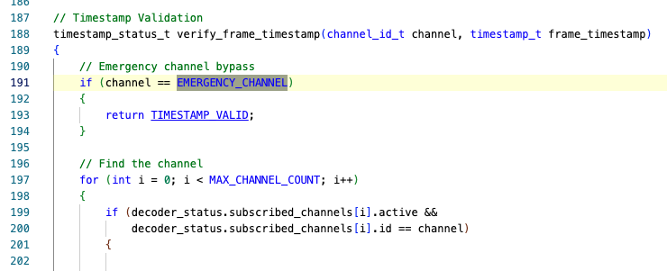

# Tufts
## Pesky Neighbor
Tufts’s design bypasses timestamp check for Emergency channel 0. Thus attacker can simply replay channel 0 frame, making it in violation of security requirement 3 (monotonically increasing timestamps).

